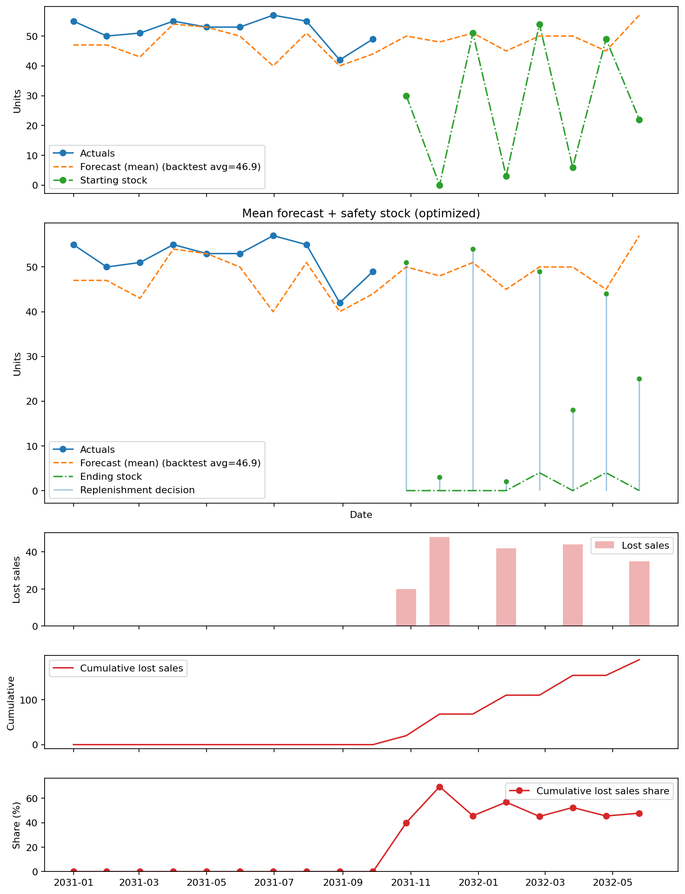

# replenishment

Stock replenishment simulation utilities.

## Environment (uv + Python 3.12)

This repo is set up to use Python 3.12 via `uv`.

```bash
uv python install 3.12
uv venv --python 3.12
source .venv/bin/activate
uv pip install -e ".[dev]"
```

Run checks with:

```bash
uv run pytest
```

## Usage

```python
from replenishment import ReorderPointPolicy, simulate_replenishment

policy = ReorderPointPolicy(reorder_point=20, order_quantity=50)
result = simulate_replenishment(
    periods=12,
    demand=[15, 10, 25, 30, 5, 12, 18, 22, 17, 19, 11, 9],
    initial_on_hand=40,
    lead_time=2,
    policy=policy,
    order_cost_per_order=12.5,
)

print(result.summary)
```

```python
from replenishment import PointForecastOptimizationPolicy, simulate_replenishment

# Point-forecast optimization uses a safety stock buffer. The
# service_level_factor is used to optimize the safety stock, so the policy
# orders the point forecast plus the safety stock amount.

policy = PointForecastOptimizationPolicy(
    forecast=[18, 20, 22, 21, 19, 17],
    actuals=[16, 19, 24, 20, 18, 15],
    service_level_factor=0.95,
)
result = simulate_replenishment(
    periods=6,
    demand=[16, 19, 24, 20, 18, 15],
    initial_on_hand=30,
    lead_time=1,
    policy=policy,
    order_cost_per_order=10.0,
)

print(result.summary)
```

```python
from replenishment import PercentileForecastOptimizationPolicy, simulate_replenishment

# Percentile-forecast optimization orders directly from the percentile target.
# No safety stock is used; the order quantity is the chosen percentile forecast
# for each period.

policy = PercentileForecastOptimizationPolicy(
    forecast=[18, 20, 22, 21, 19, 17],
    lead_time=1,
)
result = simulate_replenishment(
    periods=6,
    demand=[16, 19, 24, 20, 18, 15],
    initial_on_hand=30,
    lead_time=1,
    policy=policy,
    order_cost_per_order=8.0,
)

print(result.summary)
```

```python
from replenishment import (
    ArticleSimulationConfig,
    ForecastCandidatesConfig,
    PointForecastOptimizationPolicy,
    build_percentile_forecast_candidates,
    build_point_forecast_article_configs,
    iter_percentile_forecast_rows_from_csv,
    iter_point_forecast_rows_from_csv,
    optimize_aggregation_and_forecast_targets,
    optimize_aggregation_and_service_level_factors,
    optimize_aggregation_windows,
    optimize_forecast_targets,
    optimize_service_level_factors,
    simulate_replenishment_with_aggregation,
)

# Optimize point-forecast service levels (safety stock factors).
service_level_config = {
    "A": ArticleSimulationConfig(
        periods=6,
        demand=[16, 19, 24, 20, 18, 15],
        initial_on_hand=30,
        lead_time=1,
        policy=PointForecastOptimizationPolicy(
            forecast=[18, 20, 22, 21, 19, 17],
            actuals=[16, 19, 24, 20, 18, 15],
            service_level_factor=0.9,
        ),
        order_cost_per_order=9.0,
    )
}
service_level_result = optimize_service_level_factors(
    service_level_config,
    candidate_factors=[0.8, 0.9, 0.95],
)

# Optimize percentile forecast targets.
percentile_config = ForecastCandidatesConfig(
    periods=6,
    demand=[16, 19, 24, 20, 18, 15],
    initial_on_hand=30,
    lead_time=1,
    forecast_candidates={
        "p50": [16, 18, 20, 19, 18, 16],
        "p90": [22, 24, 26, 25, 23, 21],
    },
    order_cost_per_order=9.0,
)
percentile_result = optimize_forecast_targets({"A": percentile_config})

# Optimize order-cycle (time aggregation) windows. Use this when you want to
# decide how often to order while still aggregating demand and lead time.
aggregation_result = optimize_aggregation_windows(
    service_level_config,
    candidate_windows=[1, 2, 3],
)

# Optimize aggregation window and service-level factor together.
aggregation_service_level_result = optimize_aggregation_and_service_level_factors(
    service_level_config,
    candidate_windows=[1, 2, 3],
    candidate_factors=[0.8, 0.9, 0.95],
)

# Optimize aggregation window and forecast percentile together.
aggregation_percentile_result = optimize_aggregation_and_forecast_targets(
    {"A": percentile_config},
    candidate_windows=[1, 2, 3],
)

# Or hard-code an aggregation window if the ordering cadence is fixed.
hard_coded_window = 2
aggregated = simulate_replenishment_with_aggregation(
    periods=6,
    demand=[16, 19, 24, 20, 18, 15],
    initial_on_hand=30,
    lead_time=1,
    policy=service_level_config["A"].policy,
    aggregation_window=hard_coded_window,
    order_cost_per_order=service_level_config["A"].order_cost_per_order,
)

# Example: Loading many articles from CSVs.
# point_forecast.csv columns:
# unique_id,period,demand,forecast,actual
point_rows = iter_point_forecast_rows_from_csv("point_forecast.csv")
point_configs = build_point_forecast_article_configs(
    point_rows,
    lead_time=2,
    initial_on_hand=20,
    service_level_factor=0.9,
    holding_cost_per_unit=0.5,
    stockout_cost_per_unit=3.0,
)
service_level_result = optimize_service_level_factors(
    point_configs,
    candidate_factors=[0.8, 0.9, 1.0],
)

# percentile_forecast.csv columns:
# unique_id,period,demand,target,forecast
percentile_rows = iter_percentile_forecast_rows_from_csv("percentile_forecast.csv")
percentile_configs = build_percentile_forecast_candidates(
    percentile_rows,
    lead_time=2,
    initial_on_hand=20,
    holding_cost_per_unit=0.5,
    stockout_cost_per_unit=3.0,
)
percentile_result = optimize_forecast_targets(percentile_configs)
```

## Mean forecast + safety stock (example + plot)

This example optimizes the safety stock factor (service level) on a backtest
window, then applies the learned policy to the evaluation horizon and plots one
article.

```python
from replenishment import (
    generate_standard_simulation_rows,
    optimize_point_forecast_policy_and_simulate_actuals,
    replenishment_decision_rows_to_dataframe,
    split_standard_simulation_rows,
    standard_simulation_rows_to_dataframe,
)
from replenishment.plotting import plot_replenishment_decisions

rows = generate_standard_simulation_rows(
    n_unique_ids=1,
    periods=18,
    start_date="2031-01-01",
    frequency_days=30,
    forecast_start_period=10,
    history_mean=52,
    history_std=6,
    forecast_mean=48,
    forecast_std=5,
    lead_time=2,
    initial_on_hand=30,
    current_stock=30,
    seed=7,
)
backtest_rows, eval_rows = split_standard_simulation_rows(rows)

optimized, _, decision_rows = optimize_point_forecast_policy_and_simulate_actuals(
    backtest_rows,
    eval_rows,
    candidate_factors=[0.8, 0.9, 1.0],
)

rows_df = standard_simulation_rows_to_dataframe(rows, library="pandas")
decision_df = replenishment_decision_rows_to_dataframe(
    decision_rows, library="pandas"
)

example_id = decision_df["unique_id"].iloc[0]
plot_replenishment_decisions(
    rows_df,
    decision_df,
    unique_id=example_id,
    title="Mean forecast + safety stock (optimized)",
    decision_style="line",
)
```



## Standard simulation input schema

When you want a single file that powers both point-forecast and percentile-forecast
optimization, use the standard schema below. The CSV is row-based, with one row per
`unique_id` and date (`ds`). The `ds` column should be ISO-8601 (so lexical sorting
matches chronological order) and should include historical demand/actuals plus future
forecast-only rows beyond your backtest cutoff date.

Required columns:

- `unique_id`: Article identifier.
- `ds`: Date for the period (ISO-8601 recommended).
- `demand`: Actual demand used in the simulation. Required for CSV inputs; for DataFrame
  inputs it can be omitted and will be derived from actuals (backtest) or forecast
  (future) values.
- `forecast`: Point forecast for the same period.
- `actuals`: Actuals used to score forecast error for point-forecast optimization.
- `holding_cost_per_unit`
- `stockout_cost_per_unit`
- `order_cost_per_order`
- `lead_time`
- `initial_on_hand` (alias: `initial_demand`)
- `current_stock`: Snapshot of the latest available stock (used for downstream decisioning).

Optional percentile forecast columns:

- Any column named `forecast_<label>` will be treated as a percentile candidate for
  percentile optimization (for example, `forecast_p50`, `forecast_p90`).
- `is_forecast`: Boolean flag that marks rows after the backtest cutoff. Use this to split
  history used for optimization from future forecast horizons used for decisioning. When
  you reach the cutoff, `actuals` can be left blank/NaN for forecast-only rows.

Example usage:

```python
from replenishment import (
    build_percentile_forecast_candidates_from_standard_rows,
    build_point_forecast_article_configs_from_standard_rows,
    generate_standard_simulation_rows,
    iter_standard_simulation_rows_from_csv,
    optimize_forecast_targets,
    optimize_service_level_factors,
    split_standard_simulation_rows,
    standard_simulation_rows_to_dataframe,
    standard_simulation_rows_from_dataframe,
)

rows = generate_standard_simulation_rows(
    n_unique_ids=2,
    periods=6,
    forecast_start_period=4,
    history_mean=18,
    history_std=4,
    forecast_mean=20,
    forecast_std=3,
    seed=42,
)
# Convert to a DataFrame for inspection (pandas or polars). To include the demand
# column, pass include_demand=True.
df = standard_simulation_rows_to_dataframe(rows, library="pandas")
# Or start from a pandas/polars DataFrame that has history + forecast columns.
# When actuals/history are missing after the cutoff, they can be NaN.
# rows = standard_simulation_rows_from_dataframe(df, cutoff="2024-05-01")
# Or load the same schema from CSV:
# rows = list(iter_standard_simulation_rows_from_csv("simulation_inputs.csv"))
backtest_rows, forecast_rows = split_standard_simulation_rows(rows)
point_configs = build_point_forecast_article_configs_from_standard_rows(
    backtest_rows,
    service_level_factor=0.9,
)
point_result = optimize_service_level_factors(point_configs, candidate_factors=[0.8, 0.9])

# split_standard_simulation_rows also accepts a pandas/polars DataFrame directly.

percentile_configs = build_percentile_forecast_candidates_from_standard_rows(backtest_rows)
percentile_result = optimize_forecast_targets(percentile_configs)
```

## Notebook

See `notebooks/stock_replenishment_example.ipynb` for a runnable example.
For generated input data feeding the simulation and optimizers, use
`notebooks/generated_data_example.ipynb`.
