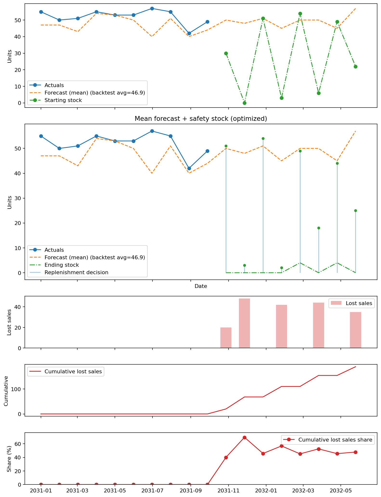
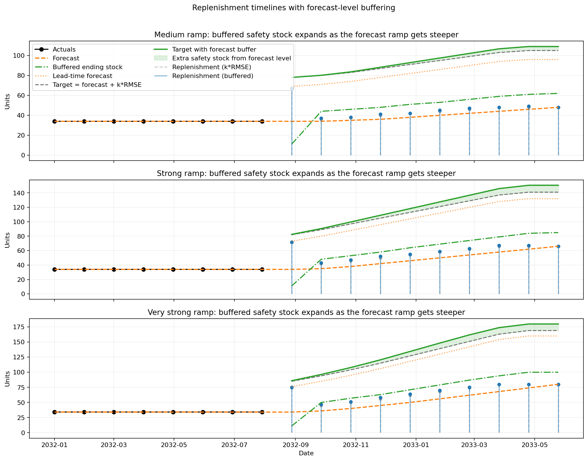
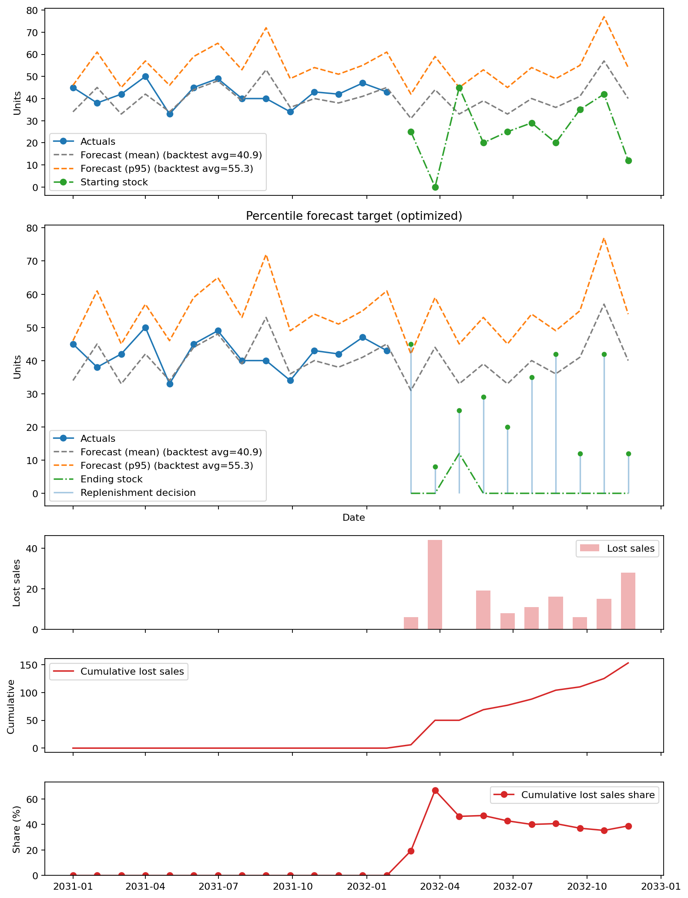

# replenishment

[](https://github.com/janrth/replenishment/actions/workflows/ci.yml)
[](https://pypi.org/project/replenishment/)
[](https://pypi.org/project/replenishment/)

`replenishment` is a Python library for stock replenishment simulation, policy optimization, and decision visualization.

It is designed for teams that want to:

- simulate replenishment policies against historical or synthetic demand
- optimize mean-forecast safety stock, `k*RMSE`, and percentile-target policies
- compare policies visually on replenishment time series
- move cleanly between CSV/DataFrame inputs and simulation configs

## Supported Python Versions

The project is tested on Python `3.10`, `3.11`, `3.12`, and `3.13`.

## Installation

### Install from PyPI

```bash
pip install replenishment
```

### Create a Development Environment with `uv`

Choose any supported Python version. `3.13` is the default below.

```bash
uv python install 3.13
uv venv --python 3.13
source .venv/bin/activate
uv sync --extra dev
```

To work on another supported version, replace `3.13` with `3.10`, `3.11`, or `3.12`.

Run the test suite with:

```bash
uv run pytest
```

## Quickstart

This example optimizes a mean-forecast safety stock factor on a backtest window
and applies the learned policy on the forecast horizon.

```python
from replenishment import (
    generate_standard_simulation_rows,
    optimize_point_forecast_policy_and_simulate_actuals,
    plot_replenishment_decisions,
    replenishment_decision_rows_to_dataframe,
    split_standard_simulation_rows,
    standard_simulation_rows_to_dataframe,
)

rows = generate_standard_simulation_rows(
    n_unique_ids=1,
    periods=18,
    start_date="2031-01-01",
    frequency_days=30,
    forecast_start_period=10,
    history_mean=52,
    history_std=6,
    forecast_mean=48,
    forecast_std=5,
    lead_time=2,
    initial_on_hand=30,
    current_stock=30,
    seed=7,
)
backtest_rows, eval_rows = split_standard_simulation_rows(rows)

optimized, _, decision_rows = optimize_point_forecast_policy_and_simulate_actuals(
    backtest_rows,
    eval_rows,
    candidate_factors=[0.8, 0.9, 1.0],
)

rows_df = standard_simulation_rows_to_dataframe(rows, library="pandas")
decision_df = replenishment_decision_rows_to_dataframe(decision_rows, library="pandas")

example_id = decision_df["unique_id"].iloc[0]
plot_replenishment_decisions(
    rows_df,
    decision_df,
    unique_id=example_id,
    title="Mean forecast + safety stock (optimized)",
    decision_style="line",
)
```

## Example Workflows

### Mean Forecast + Safety Stock

Optimize a point-forecast safety stock factor on historical rows, then inspect
the resulting replenishment decisions on the forecast horizon.



### `k*RMSE` + Forecast-Level Buffering

Use `k*RMSE` for the base safety stock and optionally increase it when lead-time
forecast quantities rise above a baseline. The README plot below uses three
articles with progressively steeper ramps so the extra safety stock is visible
directly on the replenishment timeline.



### Percentile Target Optimization

Optimize the percentile target per article on backtest rows, then simulate and
visualize the chosen forecast target on the evaluation horizon.



## Notebooks

Runnable walkthroughs live in [`notebooks/`](notebooks):

- [`notebooks/mean_forecast_safety_stock_example.ipynb`](notebooks/mean_forecast_safety_stock_example.ipynb): mean forecast safety stock optimization
- [`notebooks/k_rmse_safety_stock_optimization_example.ipynb`](notebooks/k_rmse_safety_stock_optimization_example.ipynb): `k*RMSE` optimization and forecast-level buffering
- [`notebooks/percentile_optimization_example.ipynb`](notebooks/percentile_optimization_example.ipynb): percentile-target optimization
- [`notebooks/mean_forecast_policy_variants_example.ipynb`](notebooks/mean_forecast_policy_variants_example.ipynb): compare policy variants
- [`notebooks/generated_data_example.ipynb`](notebooks/generated_data_example.ipynb): synthetic data generation
- [`notebooks/stock_replenishment_example.ipynb`](notebooks/stock_replenishment_example.ipynb): table-oriented data loading workflow

## Development and Contribution

Contributions are welcome. If you open a PR, keep it easy to review:

- add or update tests for behavior changes
- update notebooks, README examples, and plot assets when public behavior changes
- include before/after plots when you change plotting behavior
- keep PRs focused rather than bundling unrelated refactors

See [`CONTRIBUTING.md`](CONTRIBUTING.md) for setup, test, and pull request guidance.

## Good Areas for Collaboration

If you want to make the project more useful and more credible to other teams,
these are high-leverage contribution areas:

- richer policy variants, such as minimum order quantities, case-pack constraints, and promotion-aware demand handling
- benchmark datasets and scenario packs for retail seasonality, long lead times, and stockout-heavy stress tests
- more notebook walkthroughs that compare service-level objectives and business tradeoffs
- packaging and docs polish, including API docs, changelogs, and release notes
- plotting improvements for aggregate dashboards and multi-SKU diagnostics

## Project Links

- Homepage: <https://github.com/janrth/replenishment>
- Issues: <https://github.com/janrth/replenishment/issues>
- Changelog: [CHANGELOG.md](CHANGELOG.md)
- License: [LICENSE](LICENSE)
